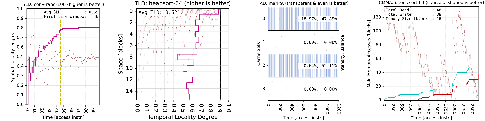
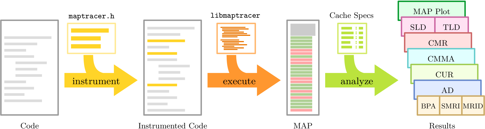
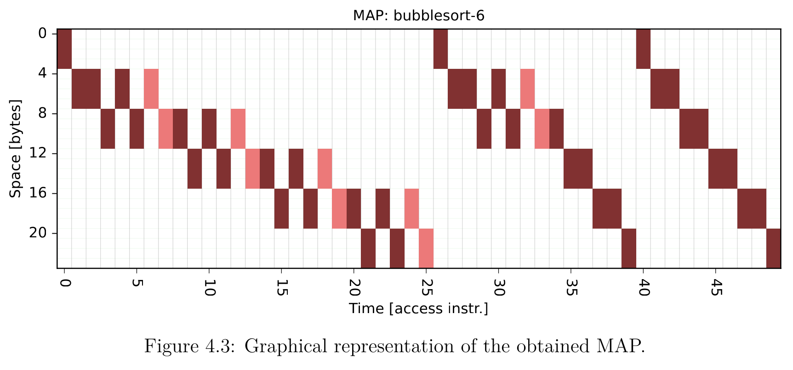
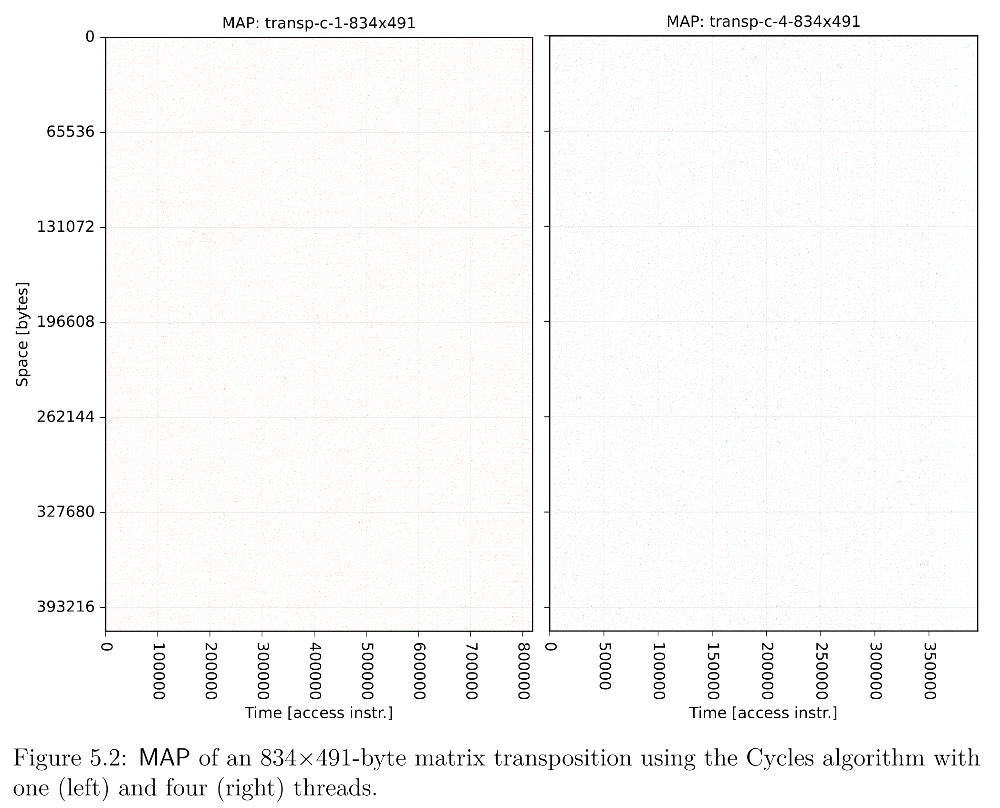
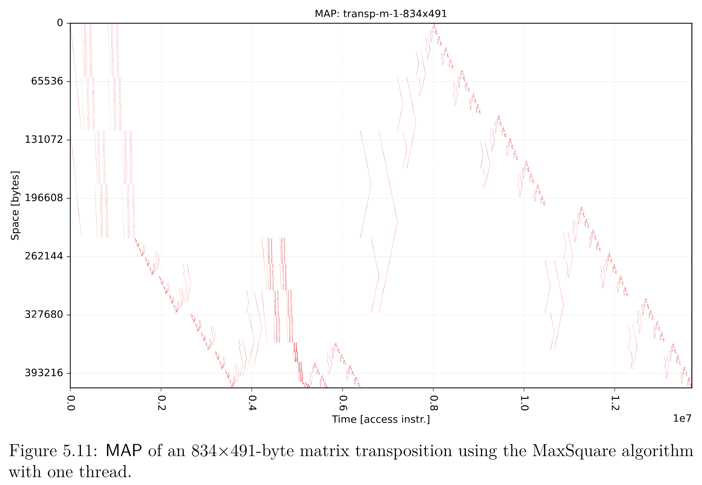
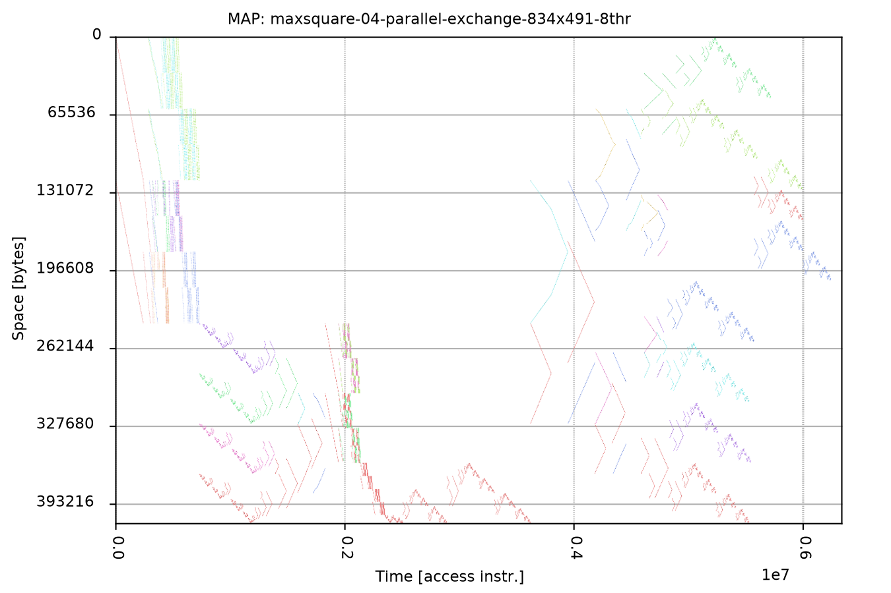
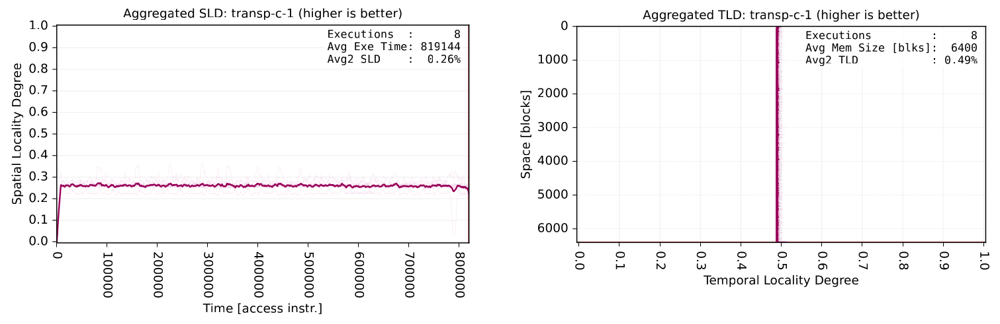
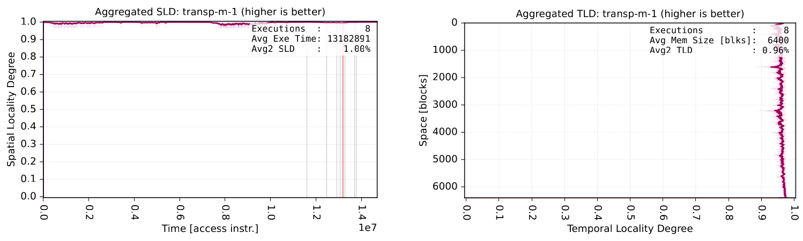
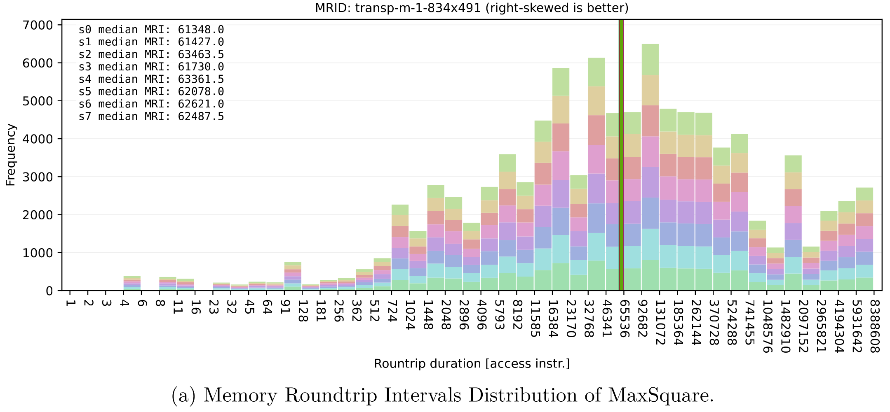

# Memory Access Pattern (MAP) Analyzer

Given that processing units such as CPU or GPU commonly access data through a _hierarchy of memory_, the manner or _pattern_ in which an algorithm traverses memory has a big impact in the performance of such program.

The tool here presented allows the user to capture the memory access pattern exhibited by a section of a given program, and analyze its interaction with a memory hierarchy (cache memory) of user-defined characteristics.

This analysis is done through a set of **metrics** (described below), constituting a measurable definition of **Cache Frindliness** that goes beyond the simple count of Cache Misses, including more sophisticated metrics such as the distribution of *time* taken by memory blocks to be re-fetched from RAM after they have been evicted (Memory Roundtrip Intervals (MRI) Distribution)

The purpose of Mapanalyzer is to offer a practical mechanism for observing and studying the memory access patterns produced by memory-intensive programs, facilitating the identification of bottlenecks and opportunities for better usage of a hierarchical memory system.

This tool is part of the [doctoral thesis of Claudio A. Parra](https://escholarship.org/uc/item/8402z970).



## Cache Friendliness Metrics
Cache-friendliness is here characterized through metrics such as Spatial Locality Degree (SLD), Temporal Locality Degree (TLD), Cache Miss Ratio (CMR), Cumulative Main Memory Access (CMMA), Cache Utilization Ratio (CUR), and Aliasing Density (AD). 

Each metric provides a unique perspective: locality degrees measure spatial and temporal memory access closeness; CMR quantifies efficiency through cache misses; CMMA tracks data movement between cache and main memory; CUR evaluates the extent of cache usage; and AD identifies problematic memory strides causing frequent cache conflicts (aliasing).

The Memory Roundtrip Interval (MRI) is introduced, quantifying the time a memory block remains outside cache after eviction. Short roundtrip intervals are particularly costly in terms of performance, suggesting that blocks are evicted prematurely.

Most metrics are discrete-domain functions, i.e., they show instant snapshots throughout the entire execution.

A complete description of the here presented cache friendliness metrics can be found in the **third chapter** of the mentioned [thesis](https://escholarship.org/uc/item/8402z970).


## Main Components
The tool contains three parts:

1. The Intel instrumentation framework [Pin](https://www.intel.com/content/www/us/en/developer/articles/tool/pin-a-dynamic-binary-instrumentation-tool.html) (dependency).
2. A pintool (MAPtracer) that uses such framework to capture and dump the MAP of a studied program into a `.map` file.
3. The analysis tool Map-Analyzer that takes the `.map` file and a cache specification file, to produce a series of plots that characterize the friendliness between the MAP and the underlying memory hierarchy.




## Installation
The three mentioned components should be installed by running

``` shell
make install
```

To see all the options, run

``` shell
make help
```

Alternatively, you could go to each sub-directory and run their own `make install`.

Subdirectories `maptrace` and `mapanalyzer` also have their own `make help` to see what the makefiles do.

## Usage
Here is a quick guide with the most common options. A complete explanation of the usage is found in the **fourth** chapter of the mentioned [thesis](https://escholarship.org/uc/item/8402z970). 

To capture the MAP of an instrumented application:

``` shell
pin -t path/to/libmaptracer.so -o path/to/mapfile.map -- <application and options>
```

This will generate a file `path/to/mapfile.map`. Then, to plot the metrics:

``` shell
# Using defaults options values.
mapanalyzer path/to/mapfile.map
```

or with some of the many options:

``` shell
# Show help.
mapanalyzer --help

# Multiple MAP files. Using defaults options values.
mapanalyzer path/to/first-mapfile.map path/to/second-mapfile.map

# Simulate cache, defining a specific cache configuration file.
mapanalyzer --mode simulate --cache path/to/cache.conf -- path/to/mapfile.map

# Plot previously simulated data.
mapanalyzer --mode plot -- path/to/pdata_MAP.json path/to/pdata_CUR.json

# Aggregate previously simulated data.
mapanalyzer --mode aggregate -- SLD-0.json SLD-1.json SLD-2.json SLD-3.json

# Simulate and plot only CMR between bytes 256 and 511 of the
# allocated memory.
mapanalyzer -ca cache.conf -mc CMR -yr MAP:256:511 -- path/to/mapfile.map

# Only Cache Miss Ratio and Alias Density, both with MAP plot in the
# background. Set the plot size, density, and format of the plots.
mapanalyzer -mc CMR,AD -bm MAP -px 12 -py 4 -dp 400 -fr pdf -- \
    path/to/mapfile.map

# Only Cache Usage Ratio from time 100 to 200 and using horizontal X-labels.
mapanalyzer -mc CUR -xr CUR:100:200 -xo h -- path/to/mapfile.map
```

## Examples

MAP exhibited by bubble sort on a tiny array of integers `[1, 6, 3, 2, 4, 5]`.


MAP of a matrix transposition using the Cycles method (if you zoom in you can see that there are accesses all over the place) with one or two threads


MAP of the same matrix transpositions but using the MaxSquare Algorithm (sequential)


MAP of Parallel MaxSquare Algorithm (multi-threaded)


Spatial (left) and Temporal (right) Locality Degree of Cycles (top) and MaxSquare (bottom) transposition algorithms.



Memory Roundtrip Distribution of Maxsquare

